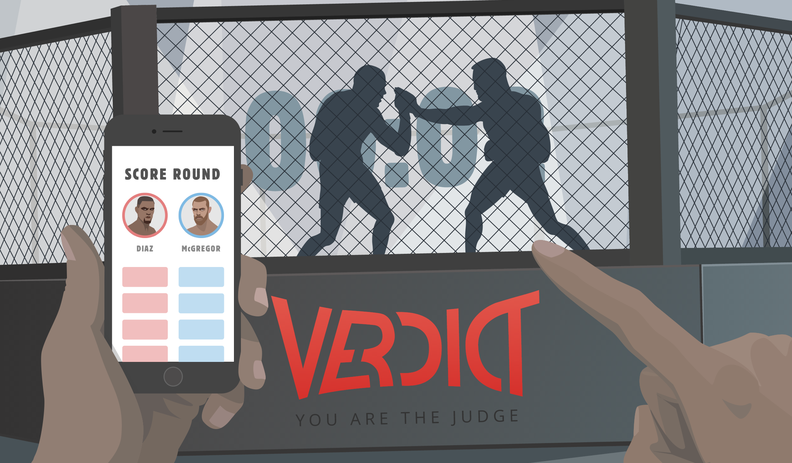

# Verdict MMA Promotional Website Animation

* Watch the animation [here](https://nerdmanship.github.io/_verdict-module/dist/)
* Live website here [here](https://verdictmma.com/)

## What is this?
An animation sequence presenting the exciting context and main use case of Verdict MMA application.
Vector graphics (SVG) made with Sketch and animation made with pure javascript and the GSAP library.
Total file size: X kB.
Informative entertainment loading blazingly fast and a consistent UX across all platforms.

## How to install
Follow these steps to implement the animation into an existing web page.

All code and assets is found in the [/dist](https://github.com/nerdmanship/_verdict-module/tree/master/dist) folder

### HTML
Copy/paste the header and download section from index.html into your html document (see comments in the html)

### Javascript
All custom code necessary to drive the header animation is bundled in the object verdictModule in app.js
The button animation is one line of code located after the verdictModule in app.js

Either link to app.js in the end of \<body\> after dependencies (see below) or insert complete verdictModule into any existing javascript document

Run the animation by calling verdicModule.detect() and verdictModule.init() in that order. These calls are already in the app.js document.

### CSS
Put the /css folder in the root folder and link to stylesheet app.css in the head or insert the contents into any existing document. Mind the path references (see below).

### Images
There are three images necessary for the project:
* appStore.svg
* googlePlay.png
* fallback.png

Either place complete /image folder in root folder or place image assets in any existing assets folder and update the path references.

### Path references that may need updating
* app.css: "background: url(../images/appstore.svg) no-repeat;"
* app.css: "background: url(../images/googleplay.png) no-repeat;"
* app.js: "fallback.src = 'images/fallback.png';"
* index.html: "\<noscript\>\\</noscript\>"

## Dependencies

* Modernizr - Must be parsed before html, goes in <head>
* GSAP TweenMax - Goes in end of <body>
* GSAP DrawSVGplugin - Goes in end of <body> after GSAP TweenmMax

## Want more web animation?

Graphics, animation and code by [Johan Strömqvist](https://www.linkedin.com/in/johanstromqvist) at [the Nerdmanship](https://nerdmanship.com/)

### Talk vector animation with the Nerdmanship

* [Facebook](http://www.facebook.com/nerdmanship)
* [Twitter](http://www.twitter.com/stromqvist)
* [Dribbble](http://www.dribbble.com/nerdmanship)
* [Codepen](http://www.codepen.io/nerdmanship)

## License

The code is available under the [MIT license](LICENSE.txt).

